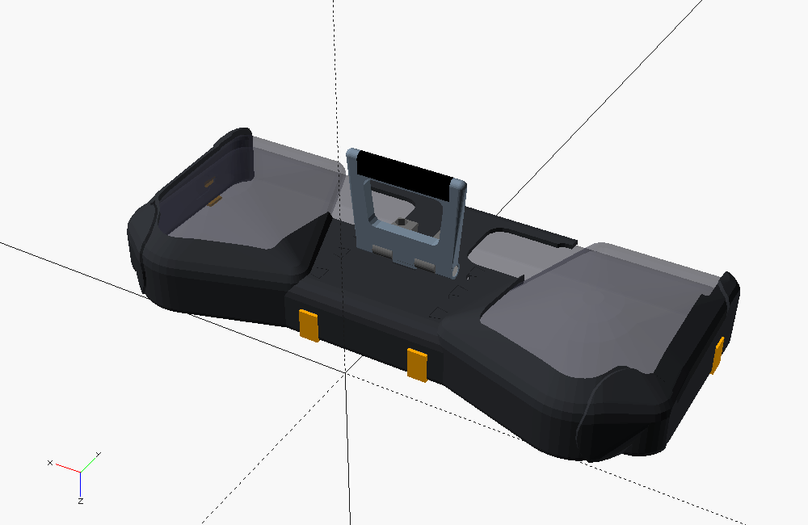
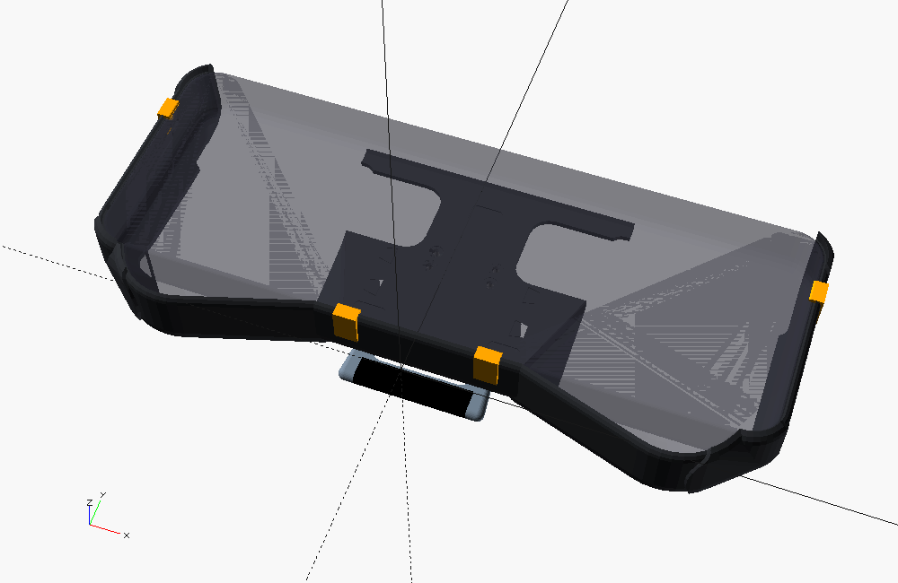
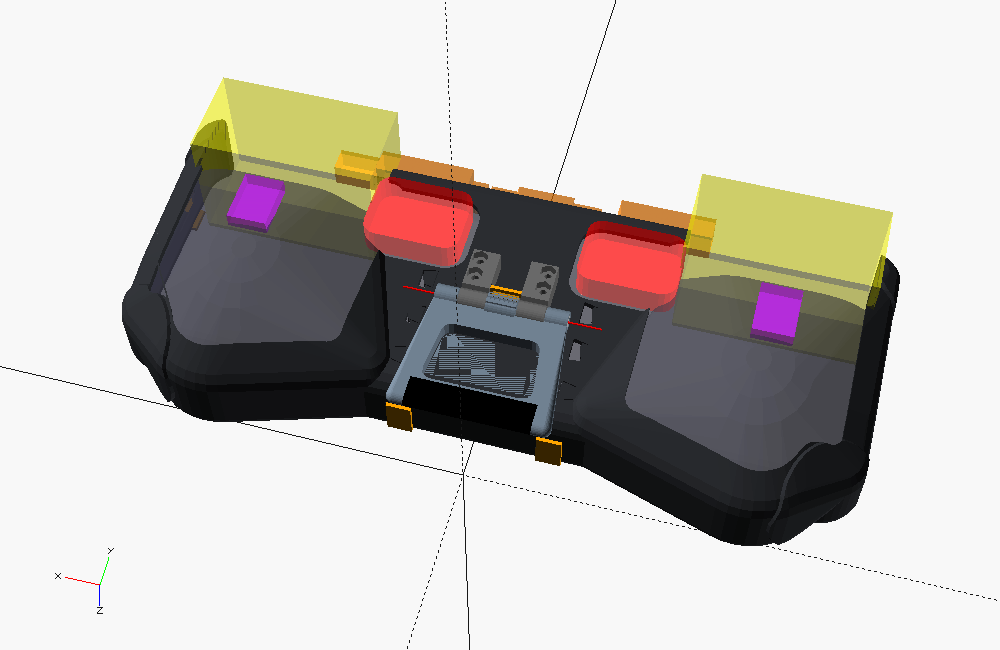
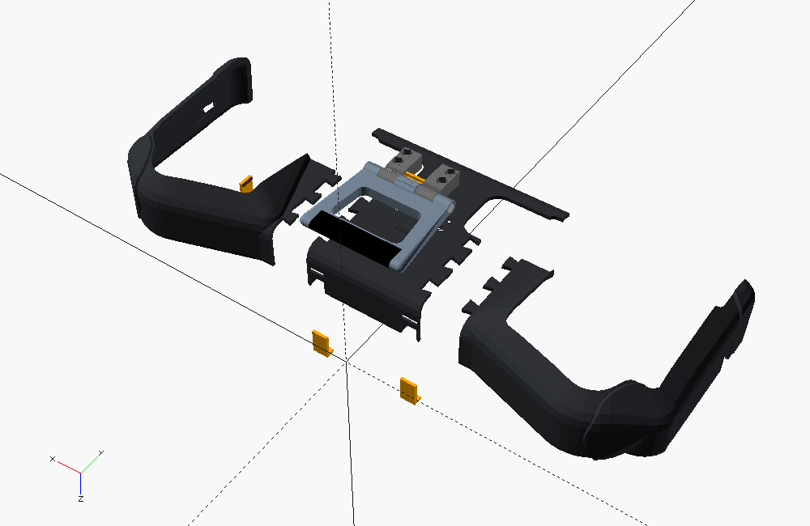
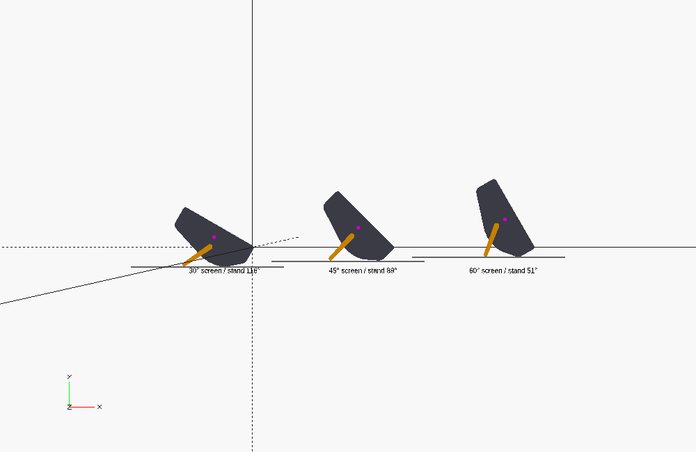

# ROG Xbox Ally X – Protective Shell with Folding Kickstand

A fully 3D-printable, parametric (OpenSCAD) protective shell for the **ROG Xbox Ally X**,
with a folding kickstand, a replaceable metal-pin hinge, a detent spring you can tune, and
a set of quick test prints.

> **Before you print the full shell:** only the overall size (290.8 × 121.5 × 50.7 mm) and
> weight (715 g) are verified specs. Every other device dimension is a clearly labeled
> `[MEASURE]` placeholder. Measure your device with
> [`MEASUREMENT_CHECKLIST.md`](MEASUREMENT_CHECKLIST.md), then print the test pieces.

---

## Contents

```
ally-x-case/
├── cad/
│   ├── params.scad        ← ALL dimensions (the only file you normally edit)
│   ├── main_shell.scad    ← shell parts, clips, TPU pads
│   ├── kickstand.scad     ← kickstand, TPU foot sleeve, stand diagram
│   ├── hinge.scad         ← hinge cheeks, detent strips, pin caps, washers
│   ├── test_fit.scad      ← 6 quick test prints
│   ├── assembly.scad      ← full preview, DEBUG view, section cuts
│   └── lib/               ← geometry libraries (device model, solver, …)
├── documentation/
│   ├── README.md                 ← this file
│   ├── MEASUREMENT_CHECKLIST.md  ← what to measure and how
│   └── images/                   ← renders
├── stl/device_independent/  ← Tests 4-6, printable before you measure
└── tools/
    ├── export_stl.sh      ← export every part to ./stl
    └── check_stl.py       ← check exported STLs (bed fit, watertight, …)
```



| Front (screen side open) | DEBUG_MODE keep-clear zones | Exploded |
|---|---|---|
|  |  |  |

*Renders use the placeholder geometry. Your shell will follow your measurements.*

## How the design works

| Part | What it does |
|---|---|
| **Rear cradle** (`rear_shell()`) | Wraps the back, all edges, the four corners (extra-thick "corner boost") and the edges of the grips. It has **no undercuts**: the Ally X drops in from the front. Printed as **3 parts** (centre + 2 grip caps) joined by dovetail keys, so it fits a 220 × 220 mm bed. |
| **Front retention** (`front_shell()` = `mounting_clips()`) | Four small replaceable clips slide into channels on the outside of the walls and hook 2.6 mm over the front-face border, never over the screen. Default: 2 on the bottom edge, 1 on each outer end. |
| **Openings** | The screen and all front controls are fully open inside a 0.6 mm raised rim. The **grip backs are open** (hands, rear buttons). The **whole top edge between the shoulders is open** by default (all ports, card slot, jack, power, volume and exhaust vents). Bumpers/triggers have their own cut-outs. The **rear intake grilles** get windows 3 mm larger than the grille on every side. |
| **Kickstand** | Open-frame plate hinged on the **lower centre of the back**, in the recess between the grips, so it never touches your hands. It folds flat against the shell, and its foot hangs into the gap between the grips. |
| **Hinge** | Two printed cheeks bolted to the shell, a **metal M3 pin** (bolt + nyloc, or a 3 mm rod) and a **replaceable PETG leaf-spring detent**. The spring clicks into notches that are **computed** for 30°, 45° and 60°. The largest opening is held by a **hard stop** (the angled cheek faces), not just friction. |

### Why a cradle with clips, not a two-piece clamshell

A rigid shell with lips all the way around cannot go onto a handheld with bulbous grips
unless it flexes a lot (which PLA/PETG won't do repeatedly) or is split across the grips
(which leaves weak seams right where you hold it). The cradle-plus-clips layout has no
undercuts, so there is no stress on install. The clips are small, replaceable and tunable
parts, which is also where wear happens.

### Priorities, as requested: fit → protection → cooling → ergonomics → kickstand → looks

* **Fit.** Everything is derived from one parametric device model, and the test pieces
  are cut from the real parts.
* **Protection.** Full perimeter wall, raised front rim, 3.6 mm reinforced corners, wrap
  onto the back.
* **Cooling.** Intakes and exhausts are fully open, nothing decorative sits over a vent,
  and the kickstand is an open frame kept below the grilles. The shell report warns if a
  measured grille overlaps the kickstand or hinge.
* **Ergonomics.** Grip backs are left bare. The shell edges follow the device with rounded
  (offset) surfaces. The case adds ≈2.75 mm per side.

---

## 1. Opening the CAD

1. Install **OpenSCAD** (2021.01 or newer, free: <https://openscad.org>).
2. Open `cad/assembly.scad` to see everything on a ghost of the device, or open
   `main_shell.scad`, `kickstand.scad`, `hinge.scad` or `test_fit.scad` to work on one
   group of parts.
3. Press **F5** for a fast preview. The console (bottom right) prints the **SHELL**,
   **KICKSTAND** and **HINGE** reports.
4. Keep all files in the folder structure above. The files include each other with
   relative paths.

Tip: *Window → Customizer* shows each file's `PART` / `TEST` selector as a drop-down.

## 2. Changing dimensions

**Edit only `cad/params.scad`.** Every file includes it, so the shell, kickstand, hinge and
test prints always stay in sync. Each value is tagged:

| Tag | Meaning |
|---|---|
| `[SPEC]` | Published spec, verified |
| `[MEASURE]` | Placeholder. **Measure your device** (checklist IDs M1…M34) |
| `[TEST]` | Tolerance. Find it with the test prints |
| `[DESIGN]` | Design choice, safe to tweak |

Most-used settings:

| Setting | Default | Notes |
|---|---|---|
| `wall_clearance` | 0.35 | gap device↔shell (Test 1) |
| `shell_thickness` | 2.4 | 6 perimeters at 0.4 mm |
| `corner_boost` | 1.2 | extra thickness on the corners |
| `top_wall_mode` | `"open"` | `"features"` = top wall with individual U-notches for each port/button/vent (fill in `top_features` first, check with Test 3) |
| `snap_clearance`, `clip_lip_gap` | 0.20, 0.05 | clip fit (Test 2) |
| `kick_target_angles` | `[30, 45, 60]` | screen angle from the table |
| `kick_hinge_y`, `kick_length` | 58, 52 | the report lists the working `kick_length` range |
| `hinge_pin_diameter` | 3.0 | M3 bolt or 3 mm rod |
| `detent_strip_t`, `detent_preload` | 1.3, 0.2 | click strength (Test 5) |
| `split_x`, `print_bed` | 36, [220, 220] | split lines of the 3-part shell; bed size for warnings |

## 3. DEBUG_MODE

Set `DEBUG_MODE = true;` at the top of `params.scad`, then preview **`assembly.scad`** (F5):

* translucent **ghost of the device** (the model the shell is built around)
* **red** = rear intake grilles, **orange** = top-edge features, **yellow** = bumpers/triggers,
  **purple** = rear buttons, **magenta ball** = centre of mass, **red line** = hinge axis
* all three reports in the console

In `assembly.scad` you can also set:
* `SHOW_ANGLE_INDEX = 0 / 1 / 2` to open the kickstand to 30° / 45° / 60°
* `SECTION = "x"` (or `"y"`) with `SECTION_AT = …` to cut the model and inspect clearances
* `EXPLODE = 15` to pull the parts apart

`kickstand.scad` with `PART = "stand_diagram"` draws the side view of the device on a table
at each target angle, with the stand, table line and centre of mass:



## 4. Exporting STLs

**In OpenSCAD:** open the file → set `PART` (or `TEST`) → set `QUALITY = "final"` in
`params.scad` → **F6** (Render) → **F7** (Export STL). Parts are already placed in their
print orientation. Final-quality renders take a few minutes per shell part.

**Ready-made STLs.** `stl/device_independent/` contains Tests 4, 5 and 6 (pin fit, hinge
mechanism, dovetail joint). They don't depend on your device measurements, so you can print
them right away. Everything else must be exported **after** you have entered your
measurements.

**Everything at once** (Linux/macOS, OpenSCAD on the PATH):
```bash
tools/export_stl.sh          # all parts + tests   -> ./stl
tools/export_stl.sh tests    # only the test prints
python3 tools/check_stl.py stl 220 220   # bed fit, watertight, bed contact
```

| File | `PART` / `TEST` | STL |
|---|---|---|
| main_shell.scad | `center`, `cap_left`, `cap_right` | shell parts |
| main_shell.scad | `clip_set` | 4 clips + 2 spares |
| main_shell.scad | `tpu_pad_set` | anti-scratch pads |
| kickstand.scad | `kickstand`, `foot_sleeve` | kickstand, TPU foot |
| hinge.scad | `cheek_left`, `cheek_right`, `detent_strip_set` | hinge |
| hinge.scad | `pin_rod_caps`, `friction_washers` | optional |
| main_shell.scad | `one_piece` | only for beds ≥ 300 mm (needs supports) |

## 5. Print orientation (already applied in the exports)

| Part | Orientation | Why |
|---|---|---|
| Shell **centre** | back plate flat on the bed | walls build straight up, and the kickstand/hinge mounting face is the smooth bed face |
| Shell **caps** | standing on the flat **outer end** | every layer is a full C-section of the wrap, so the curved grip edges print without supports. Layers run around the corner, which is strong on impact |
| **Kickstand** | inner face on the bed | the plate is strongest in bending this way; the pin bore is a teardrop (no support) |
| **Hinge cheeks** | lying on their outer face (pin axis vertical) | round, accurate pin bores; the pin load runs in the layer plane |
| **Detent strips** | standing on their long edge | the strip bends in the layer plane and does not delaminate |
| **Clips** | lying on their profile | the spine flexes in the layer plane |
| TPU pads / foot sleeve | flat / on end | – |

**Supports.** `tools/check_stl.py` measures the downward-facing area steeper than 45° for
every part in its print orientation:

| Part | > 45° overhang | Verdict |
|---|---|---|
| shell centre | ~160–480 mm² (the rounded back edges' first 2–3 mm, clip-window and pocket bridges) | no supports |
| grip caps | ~1300 mm², but only **~100 mm² steeper than 60°**. The rest is 45–60° slopes on the grip-bottom arc plus short flat bridges | normally no supports in PETG with good part cooling. If your printer curls on 60° overhangs, use **tree supports from build plate only** |
| kickstand | ~520 mm², almost all short bridges (window top, TPU-sleeve recess) | no supports |
| cheeks, clips, strips, pads, tests | small bridges only | no supports |

## 6. Materials

| Part | Recommended | Why |
|---|---|---|
| Shell parts | **PETG** (best) · ASA/ABS · PLA+ acceptable | PETG is tough, slightly flexible, won't shatter on a drop, and handles the warm exhaust air. Standard PLA can creep near the vents on long, hot sessions |
| Kickstand, hinge cheeks | **PETG** | toughness |
| Detent strips, clips | **PETG only** | they flex every time you use them; PLA fatigues and snaps |
| Pads, foot sleeve | **TPU 95A** | grip, no scratches, no rattles |

Hardware (metric, commonly available):

| Qty | Item | Use |
|---|---|---|
| 1 | M3 × 50 socket-head cap screw (ISO 4762 / DIN 912) | hinge pin |
| 1 | M3 nyloc nut (DIN 985) | hinge pin |
| 4 | M3 × 10 countersunk screw (ISO 10642 / DIN 7991) | cheeks → shell |
| 4 | M3 hex nut (DIN 934) | cheeks |
| 2 | M3 × 16 screw (any head, or set screw) | detent preload (length is printed in the HINGE report) |
| – | alternative pin: 3 mm steel rod / drill blank, length = HINGE_SPAN − 1.5 (see HINGE report) + `pin_rod_caps` | |

## 7. Slicer settings

| Setting | Shell / kickstand / cheeks | Clips / detent strips | TPU |
|---|---|---|---|
| Nozzle / layer | 0.4 / 0.2 mm | 0.4 / 0.16–0.2 mm | 0.4 / 0.2 mm |
| Walls (perimeters) | **5** (the 2.4 mm walls become solid) | **4** (solid) | 3 |
| Top / bottom layers | 5 / 5 | solid | 3 / 3 |
| Infill | 30–40 % gyroid (100 % for cheeks) | 100 % | 20 % |
| Supports | none | none | none |
| Brim | 5 mm on the caps and cheeks, 3 mm on the strips | 3 mm | – |
| Seam | rear/aligned, away from edges | – | – |
| Elephant-foot compensation | 0.15 mm (important for the jigsaw keys) | 0.1 | – |
| PETG temps (typ.) | 235–245 °C nozzle, 75–85 °C bed, fan 30–50 % | same | TPU 220–230 °C, slow |

Holes printed in the kickstand (horizontal) may need a 3 mm drill bit run through by hand.
That is normal for teardrop holes.

## 8. Assembly

1. **Test pieces first** (see below). Transfer the tolerances into `params.scad`, then export.
2. **Clean up** the parts: remove brims, and deburr the clip channels and dovetail keys with a
   hobby knife.
3. **Join the shell.** Lay the centre part and a cap back-down, line up the dovetail keys,
   and press them together **perpendicular to the back plate**. They should need firm
   thumb pressure. If too loose, add a drop of CA glue **or** reprint
   with a smaller `joint_clearance`.
4. **Pads.** Press the TPU pads into the pockets on the inside (back and ends). Use a dot of
   double-sided tape if needed. The tape goes on the shell, **never on the device**.
5. **Hinge cheeks.** Drop an M3 nut into each nut trap on top of the cheeks. From **inside**
   the shell, insert the 4 countersunk M3 × 10 screws through the back plate and tighten
   them into the nuts. The heads must sit **below** the inner surface (0.3 mm recess).
6. **Detent strip.** Slide the medium strip (nub towards the pin axis) into the side pockets
   of both cheeks. Turn the two preload screws into the tops of the cheeks until they just
   touch the strip ends.
7. **Kickstand.** Hold the kickstand between the cheeks (cam knuckle between them). Push the
   M3 × 50 bolt through the left outer knuckle, cheek, cam, cheek and right knuckle. Put the
   nyloc in the right-hand hex pocket and tighten until the bolt is **flush**. The bolt turns
   with the stand. Do not over-tighten: friction comes from the detent, not the bolt.
8. Snap the **TPU foot sleeve** over the kickstand foot.
9. Check that the stand clicks: closed (pulled flat, no rattle) → 60° → 45° → 30°
   (stops hard at the last one).

## 9. Installing and removing the case

**Install**
1. Pull out the 4 clips (they slide out of their channels).
2. Lay the shell on the table, back down. Put the Ally X in **screen-up**, bottom edge
   first, and lower it into the cradle. It should settle flat with no force.
3. Slide each clip into its channel from the front until it **clicks**. The lip should lie
   flat on the front-face border.

**Remove**
1. Put a fingernail under the lip of a clip and lift. The barb releases and the clip
   slides out. Do all four.
2. Lift the Ally X out by the top edge.

Never pry against the screen. The clips only touch the plastic border.

## 10. Adjusting kickstand tension

From lightest to strongest adjustment:

1. **Preload screws** (the 2 screws on top of the cheeks). Turn clockwise ¼ turn at a
   time. Each full turn (0.5 mm pitch) raises the click force a lot, so stay within ~1
   turn from "just touching".
2. **Swap the strip.** `detent_strip_set` prints soft/medium/firm strips
   (`detent_strip_t` −0.2 / ±0 / +0.2 mm). Changing the strip takes 1 minute: back off the
   preload screws and slide it out sideways.
3. **Deeper notches.** `detent_notch_depth` +0.1 mm (reprint the kickstand).
4. **Optional TPU friction washers.** Set `use_friction_washers = true` (reprints the
   kickstand/cheek spacing) for extra damping.

The KICKSTAND report estimates the detent holding torque against the torque the stand
sees at each angle, and the strip's bending stress. It warns if the strip is overloaded.

---

## Test-fit strategy (do this first)

All tests are cut from the real parts, so what fits here fits in the final print.

| # | `TEST =` | Print time* | What to check | Values it tunes |
|---|---|---|---|---|
| 1 | `1` (`TEST1_CORNER="bottom"` / `"top"`) | 30–45 min | Press the corner piece onto the grip corner. No rocking, no force, no gap > 0.5 mm. | `wall_clearance`, grip `[MEASURE]`s |
| 2 | `2` | 30 min | Slice of the bottom edge + 3 clips (1/2/3 notches = lip gap −0.15/±0/+0.15). Clip clicks in, lip flat, no wobble. | `snap_clearance`, `clip_lip_gap`, `clip_catch_*` |
| 3 | `3` (`TEST3_SIDE="right"`/`"left"`) | 45–60 min each | Top edge: plug in a USB-C cable and a 3.5 mm plug, insert a microSD card, press power/volume, pull both triggers fully. Nothing may touch. | `shoulder_cut_*`, `top_features` |
| 4 | `4` | 15 min | Row V: smallest hole the pin **turns** in → `pin_clearance_rot`. Row H: hole the pin is **snug and does not turn** in → `pin_clearance_snug`. Holes 0…4 = +0.0…+0.4 mm. | pin clearances |
| 5 | `5` | ~1.5 h | Complete hinge on a piece of shell back: clicks, holds, hard stop, no rattle when closed. (The notch angles come from your current params; placeholder angles are fine for judging click strength) | `detent_strip_t`, `detent_preload`, `detent_notch_depth`, `knuckle_gap` |
| 6 | `6` | 20 min | Dovetail pairs (−/0/+): pick the one that presses together firmly by hand | `joint_clearance` |

*approximate, PETG at normal speeds.

**Transferring results:** write the new value into `params.scad`, save, re-export. No other
file needs editing. Example: Test 4 hole "2" turns freely → `pin_clearance_rot = 0.2`.

**Recommended order:** 4 → 6 → 1 → 2 → 3 → 5 → full print.

## How the kickstand angles are computed

`lib/stand_solver.scad` builds a 2D side view of the case from your measured device model.
For each target angle it:

1. finds the case's lowest point on the table (grip bottom or grip back)
2. solves the kickstand opening angle that puts the foot on the table
3. checks that the **centre of mass lies between the two supports** (the margins are in mm)
4. estimates the stand load, the hinge torque, and whether the detent can hold it

The cam notches are cut at the solved angles. With the placeholder geometry:

```
30° screen → stand 116.4° (hard stop), margins 47 / 17 mm
45° screen → stand  88.9° (detent),   margins 44 / 33 mm
60° screen → stand  51.4° (detent),   margins 30 / 21 mm
```

Once you have entered your measurements, **re-read the report**: it lists every
`kick_length` that keeps ≥ 4 mm stability margin at all three angles.

## Known limitations (read these)

* **Unverified device geometry.** The device model is a set of rounded primitives (tori and
  ellipsoids) driven by your measurements. It is conservative at convex edges (smaller
  radius = more room), but grip surfaces are approximate. That is why the grip backs are
  left open and fit is proven with Test 1 first.
* **Port positions are not modelled by default** (`top_wall_mode = "open"`). If you want a
  top wall with individual cut-outs, measure M34 and verify with Test 3.
* **The detent strength is an estimate** (beam theory, PETG E ≈ 2 GPa). Test 5 is the truth.
  The largest opening is held by the hard stop regardless.
* **Centre-of-mass depth** (`com_depth`) is a guess. It shifts the stability margins, which
  the report shows.
* The closed kickstand foot hangs ≈12 mm into the gap between the grips (below the centre
  body, never below the grips). Raise `kick_min_foot_y` / shorten `kick_length` if you
  prefer it flush; the report then shows which angles still work.

## Sources used for verification

* [Xbox – ROG Xbox Ally product page](https://www.xbox.com/en-US/handhelds/rog-xbox-ally)
* [ASUS ROG – ROG Xbox Ally X (2025) spec page](https://rog.asus.com/us/gaming-handhelds/rog-ally/rog-xbox-ally-x-2025/spec/)
* [Windows Central – Xbox Ally X review](https://www.windowscentral.com/hardware/asus/asus-rog-xbox-ally-x-review)
* [TechPowerUp – ROG Xbox Ally X review: A Closer Look](https://www.techpowerup.com/review/asus-rog-xbox-ally-x/3.html) and [Ports](https://www.techpowerup.com/review/asus-rog-xbox-ally-x/9.html)
* [Stevivor – ROG Xbox Ally X review](https://stevivor.com/reviews/rog-xbox-ally-x-review-is-this-an-xbox/)
* [Retro Catalog – ROG Xbox Ally X specifications](https://retrocatalog.com/retro-handhelds/rog-xbox-ally-x)
